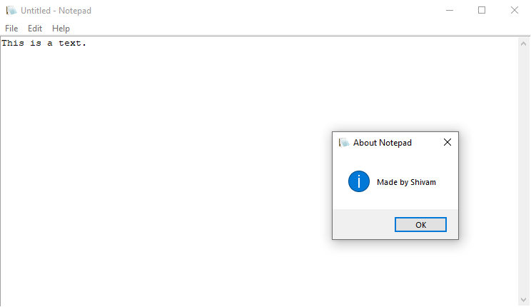

# Notepad

This is a notepad created using tkinter package in Python.
It has functionalities like create a new file, save a file, open an existing file.
One can use cut, copy and paste features to edit the text as well.

## Technologies used 
* Programming Language: [Python 3](https://www.python.org/)
* Packages used: [tkinter](https://docs.python.org/3/library/tkinter.html)

## How to run?
1. Install Python 3
2. Clone this repository
3. Start a cmd prompt
4. Change directory to the cloned repo folder
5. Type `python notepad.py` and hit enter
